# sparkcube-parts
Modifications for the Sparklabs Sparkcube.  
 
All Parts can be printed without support.  
In Places where support is needed, there are small membranes that need to be drilled out after printing.  
See the "support" Folder in every FreeCAD File.

## accessories_holder
Neat little box to store a USB-Drive and -Cable  
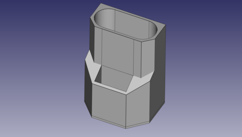

## case
Main File for anything related to the outer shell of the Printer.   
These files are not compatible with the original Sparkcube, as my Printer is larger in X and Z.  
 
It sports a Electronics-Compartment made from bent Sheetmetal, Cutouts for fitting a Udoo Quad/Dual Board and a Touchscreen LCD Display.  
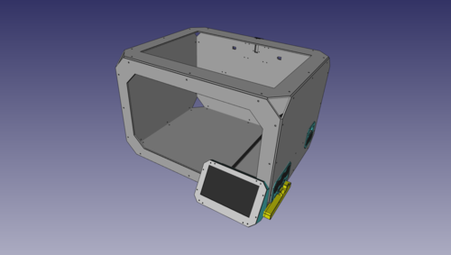
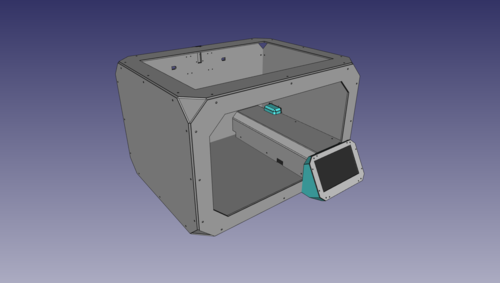

## dual-mount
This is a X-Carriage and Mount for two E3Dv6 Hotends, as dropin for the stock Sparkcube carriage.  
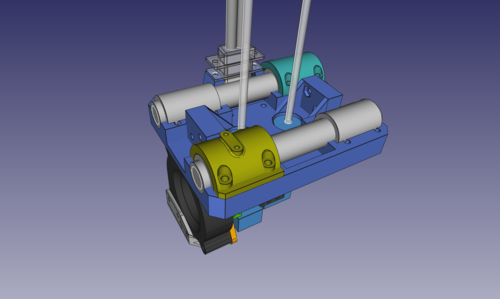
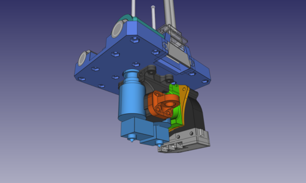

## dual-x
With these Parts, a stock Sparkcube may be upgraded to use two independent Extruders for printing.  
Be aware that this reduces your Printarea in X by quite a bit. I recommend building your whole printer about 70mm wider.  
The design of these parts is inspired by the original Sparklab parts, but are not compatible with any of them (except the Z-Assembly of course).  
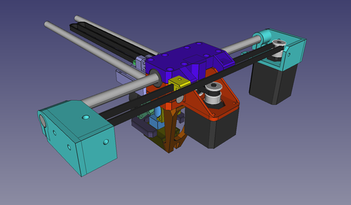
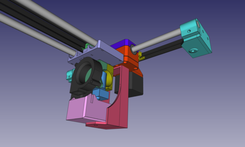

## mpx-clip
A simple piece that clips around a MPX Connector to prevent it from accidential disconnecting.  
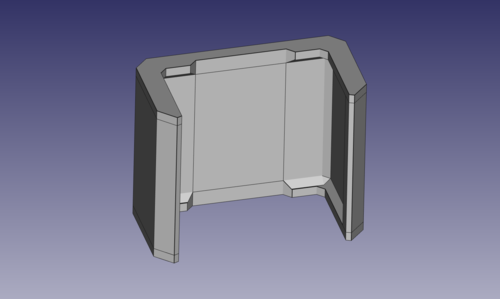

## Spoolholder
A Spoolholder that is compatible with the Hole-Pattern found on the Back of the Case  
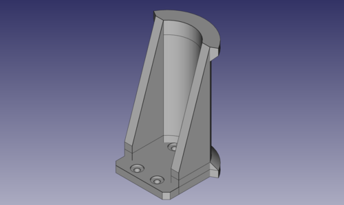

## Webcam-Mount
A fixture to mount the PCB of a Logitech C270 Webcam to a Aluminium Extrusion without the need of any Screws.  
Just insert the Posts sideways into the Profile, rotate them 90°, screw in the baseplate and you're done.  
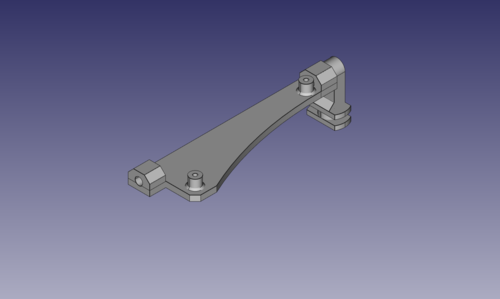

## z-endstop-adapter
Use this if you prefer to use an M3 Screw for your Z-Endstop instead of an M5 one.  
Requires an aditional Hole in the Z-Gantry to secure it in place.  
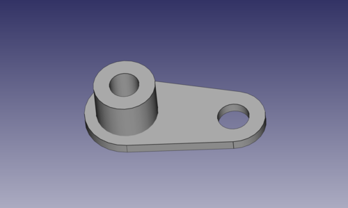

